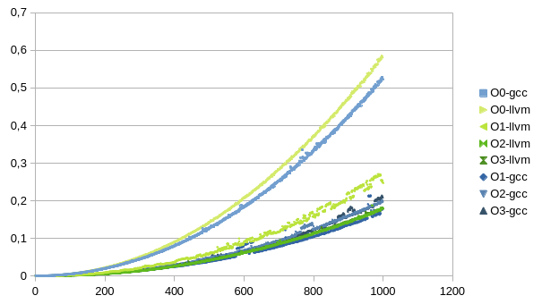
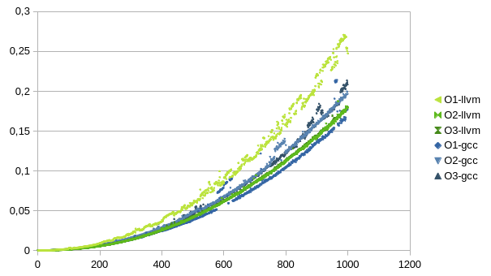
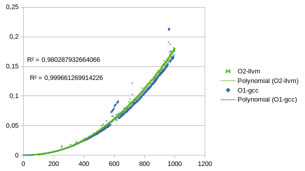

# Исследование компиляторов LLVM и GCC для risc-v

## Ход исследования

Для исследования измеряли скорость сортировки массива алгоритмом O(n^2) на различных длинах массива случайных чисел при разных оптимизациях компилятора.

В результате получили графики времени выполнения программы:

Как видно из графика оптимизации значительно уменьшают время выполнения программы, так что уберем графики для О0.

Поведения оптимизаций llvm ожидаемо, чем выше уровень тем быстрее выполняется программа, но 3 уровень уже не даёт ускорения, тогда как с gcc все не так однозначно. Наибольшего ускорения получается достичь при O1 оптимизации, тогда как для следующих оптимизация результат значительно ухудшается.

К тому же видно что время выполнения кода после gcc не стабильно, бывают "скачки". Коэффициент детерминации R^2 для двух лучших результатов gcc и llvm соответственно: 0.9803 и 0.9997.

Но несмотря на выбросы, llvm медленнее на 6.7%.

# Типа Вывод

Gcc имеет смысл использовать только с O1, а llvm с O2, т.к. они выда.т лучшие результаты, при этом результат gсс сильно не стабилен пусть и на 7% лучше чем llvm.