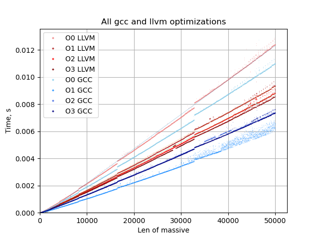

# Исследование компиляторов GCC и LLVM

## Ход исследования

Для проверки производительности кода, полученного от GCC и LLVM измеряли скорость сортировки массива случайных чисел. В качестве алгоритма сортировки использовали сортировку слиянием (O(nLog(n))) с постоянным переопределением вспомогательного массива на куче. Использовался массив длинной 50000 чисел, замеры проводились с шагом 10 чисел, по 10 замеров на одной длине массива, при этом сначала снимался 1 массив целиком, потом 2, 3 и т.д. и после результат усреднялся. 

Для проведения тестов было написано несколько баш скриптов для компилирования всех тестов `build_all.sh`, запуска всех тестов на qemu `start_all.sh` и запуска всех тестов на плате (но он остался на плате).

### QEMU

Результаты всех замеров лежат в `data/qemu`. Поведение оптимизаций обоих компиляторов полностью совпадают с предыдущим исследованием, сейчас так же лучшими оказались O1 для gcc и O3 для llvm.

Старые результаты:


Новые результаты:



В этот раз графики получились линейными, так что можно провести анализ скорости выполнения программы в мкс на 1 дополнительное значение в массиве.

```
Results on QEMU
qemu_gcc_O0  0.22551  us/val
qemu_gcc_O1  0.12927  us/val
qemu_gcc_O2  0.15098  us/val
qemu_gcc_O3  0.14963  us/val
qemu_llvm_O0  0.25394  us/val
qemu_llvm_O1  0.19039  us/val
qemu_llvm_O2  0.17955  us/val
qemu_llvm_O3  0.17429  us/val
```

Для сравнения переведем эти данные в относительный вид:

```
GCC
O0 174.4%
O1 100.0%
O2 116.8%
O3 115.7%
LLVM
O0 145.7%
O1 109.2%
O2 103.0%
O3 100.0%
```

Как видно из результатов, скорость работы программы при O2 и O3 оптимизации gcc одинакова до погрешности.

### LicheePi4A

Результаты всех замеров лежат в `data/LicheePi4A`. В этот раз удалось провести бенчмарк также и на реальном процессоре Risc-V на плате LicheePi4A.


Относительно qemu, результат во многом схожий, поведение оптимизаций совпадает, тут также лучший результат gcc это O1, а llvm это O3 оптимизация.

```
Results on Licheepi4a 
licheepi_gcc_O0  0.48739  us/val
licheepi_gcc_O1  0.13798  us/val
licheepi_gcc_O2  0.15011  us/val
licheepi_gcc_O3  0.14966  us/val
licheepi_llvm_O0  0.37996  us/val
licheepi_llvm_O1  0.18363  us/val
licheepi_llvm_O2  0.18048  us/val
licheepi_llvm_O3  0.17706  us/val
```

Относительные результаты также похожи:

```
GCC
O0 353.2%
O1 100.0%
O2 108.8%
O3 108.5%
LLVM
O0 214.6%
O1 103.7%
O2 101.9%
O3 100.0%
```

### Gem5

Результаты всех замеров лежат в `data/gem5`. Т.к. потактовая симуляция на gem5 дело крайне ресурсоемкое и медленное, то мне удалось сделать расчеты только для 100 точек (т.е. массив длинной до 1000 элементов) для каждой оптимизации. 


```
Results on GEM5
gem5_gcc_O0  54.13833  us/val
gem5_gcc_O1  15.83375  us/val
gem5_gcc_O2  16.36795  us/val
gem5_gcc_O3  16.36918  us/val
gem5_llvm_O0  53.4226  us/val
gem5_llvm_O1  18.49606  us/val
gem5_llvm_O2  19.66891  us/val
gem5_llvm_O3  21.73218  us/val
```

Как видно абсолютное время исполнения на 2 порядка больше нежели время исполнения на плате или же функциональном симуляторе. Однако это не помешает провести сравнение поведения симулятора и платы через относительные показатели, для чего их надо рассчитать.

```
GCC
O0 341.9%
O1 100.0%
O2 103.4%
O3 103.4%
LLVM
O0 288.8%
O1 100.0%
O2 106.3%
O3 117.5%
```

### Сравнение результатов с платы и эмулятора

Сведем относительные данные в таблицу.

| Gcc | qemu  | LichePi4A | Gem5 |
|-----|-------|-----------|------|
| O0  | 174%  | 353%      |341,9%|
| O1  | 100%  | 100%      |100,0%|
| O2  | 116,8%| 108.8%    |103,4%|
| O3  | 115,7%| 108.5%    |103,4%|

| LLVM | qemu   | LichePi4A | Gem5 |
|------|--------|-----------|------|
| O0   | 145.7% | 214%      |288,8%|
| O1   | 109.2% | 103.7%    |100,0%|
| O2   | 103%   | 101.9%    |106,3%|
| O3   | 100%   | 100%      |117,5%|

#### Qemu VS LicheePi4A

Как видно из таблицы, любая оптимизация плате принесла вдвое большие результаты чем на qemu. При этом отрыв O1 оптимизации от остальных вдвое сократился.

Результаты поведения llvm похожи на поведение gcc, наличие любой оптимизации также вдвое лучше ее отсутствия, при этом различия между скоростями оптимизаций вдвое уменьшились.

Единственным крупным отличием между поведением кодов на плате и эмуляторе это скорость выполнения O0 оптимизаций. На плате код от llvm оказался быстрей чем код от gcc.

#### Gem5 VS LicheePi4A

Смотря на полученные результаты, хотеться сказать что они крайне похожи на результаты платы из-за большого отрыва O0 оптимизации ото всех остальных, это проявляется и у gcc и у llvm. Однако у gcc отрыв между оптимизациями меньше чем тот же отрыв на плате.

Результаты теста llvm же крайне сильно выбиваются из общей картины. В этот раз самым быстрым оптимизатором оказался O1. При этом отрыв между всеми оптимизациями значительно больше чем у платы или qemu.

Такое сильное отличие может быть связано с размером выборки, т.к. gem5 работал только с длинной массива до 1000. Для проверки этого варианта увеличить выборку для gem5 не получиться с моими вычислительными мощностями, но можно ограничиться выборку для qemu и платы.

### Короткая выборка

##### QEMU


```
Only 100 points
qemu_gcc_O0_100  0.1442  us/val
qemu_gcc_O1_100  0.07953  us/val
qemu_gcc_O2_100  0.11345  us/val
qemu_gcc_O3_100  0.11305  us/val
qemu_llvm_O0_100  0.1653  us/val
qemu_llvm_O1_100  0.13682  us/val
qemu_llvm_O2_100  0.13245  us/val
qemu_llvm_O3_100  0.12787  us/val

QEMU results analysis: 
Best GCC result - 0.07953 us/val - in O1
Best LLVM result - 0.12787 us/val - in O3
Percentage for the best result
GCC
O0 181.3%
O1 100.0%
O2 142.7%
O3 142.1%
LLVM
O0 129.3%
O1 107.0%
O2 103.6%
O3 100.0%
```

##### Licheepi4A


```
Only 100 points
qemu_gcc_O0_100  0.29904  us/val
qemu_gcc_O1_100  0.08596  us/val
qemu_gcc_O2_100  0.09479  us/val
qemu_gcc_O3_100  0.09551  us/val
qemu_llvm_O0_100  0.22209  us/val
qemu_llvm_O1_100  0.11509  us/val
qemu_llvm_O2_100  0.11528  us/val
qemu_llvm_O3_100  0.11564  us/val

QEMU results analysis: 
Best GCC result - 0.08596 us/val - in O1
Best LLVM result - 0.11509 us/val - in O1
Percentage for the best result
GCC
O0 347.9%
O1 100.0%
O2 110.3%
O3 111.1%
LLVM
O0 193.0%
O1 100.0%
O2 100.2%
O3 100.5%
```

Сведем относительные данные в таблицу.

| Gcc | qemu  | LichePi4A | Gem5 |
|-----|-------|-----------|------|
| O0  | 181,3%| 347,9%    |341,9%|
| O1  | 100%  | 100%      |100,0%|
| O2  | 142,7%| 110%      |103,4%|
| O3  | 142,1%| 111,1%    |103,4%|

| LLVM | qemu   | LichePi4A | Gem5 |
|------|--------|-----------|------|
| O0   | 129,3% | 193%      |288,8%|
| O1   | 107,0% | 100%      |100,0%|
| O2   | 103,6% | 100,2%    |106,3%|
| O3   | 100,0% | 100,5%    |117,5%|

В результате видно, что скорость выполнения на qemu не зависит от размера выборки. Однако на малой выборке на плате (так же как и у gem5) лучшие показатели у llvm были при O1 оптимизации, но разница на самом деле лежит в пределах погрешности.

# Типа выводы

Как показывает практика, 